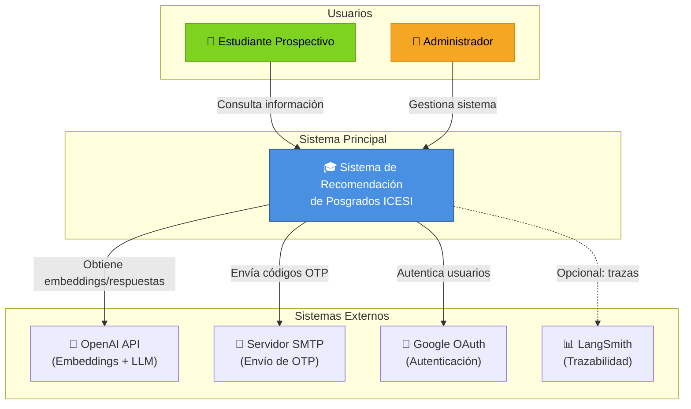
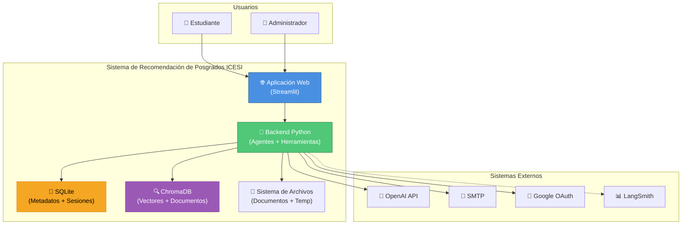
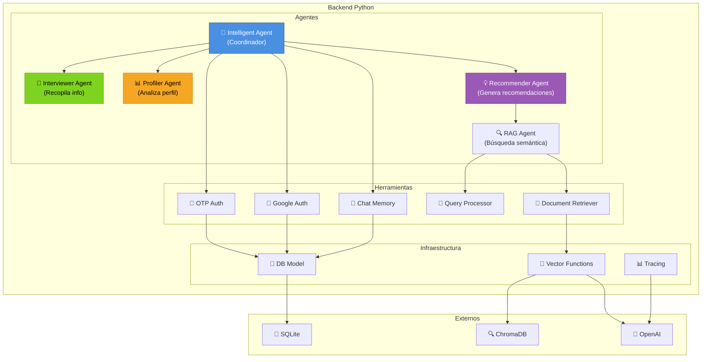
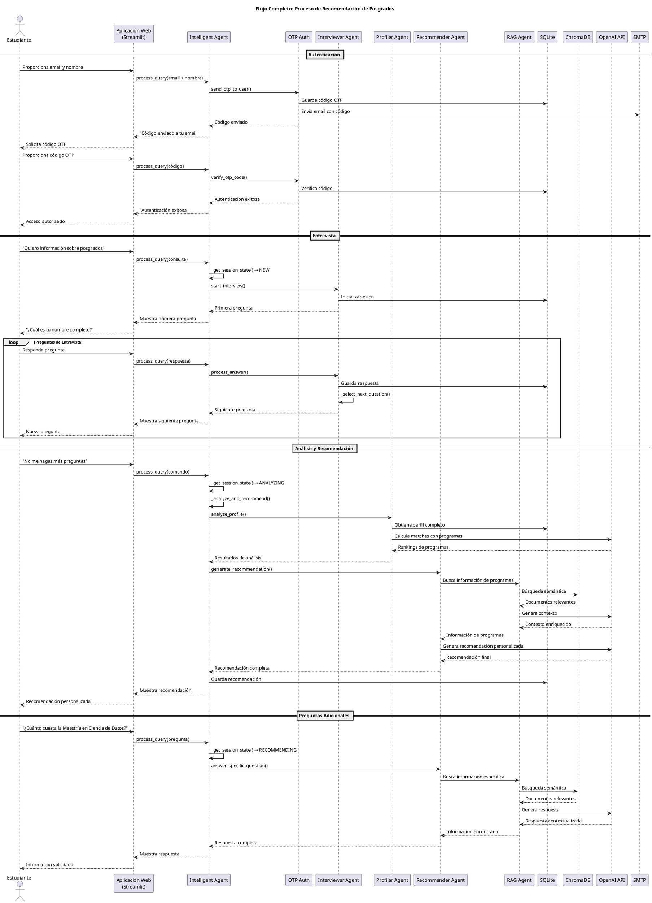
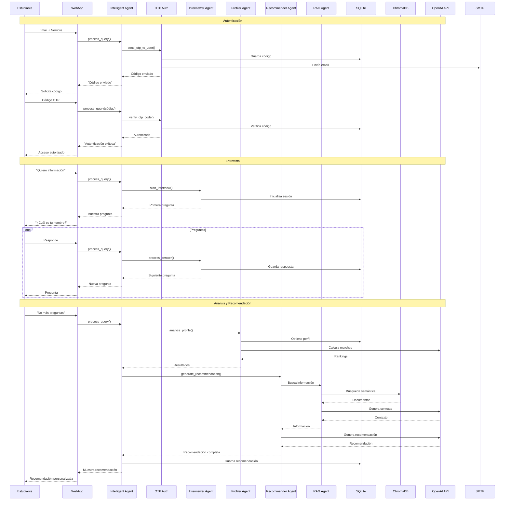
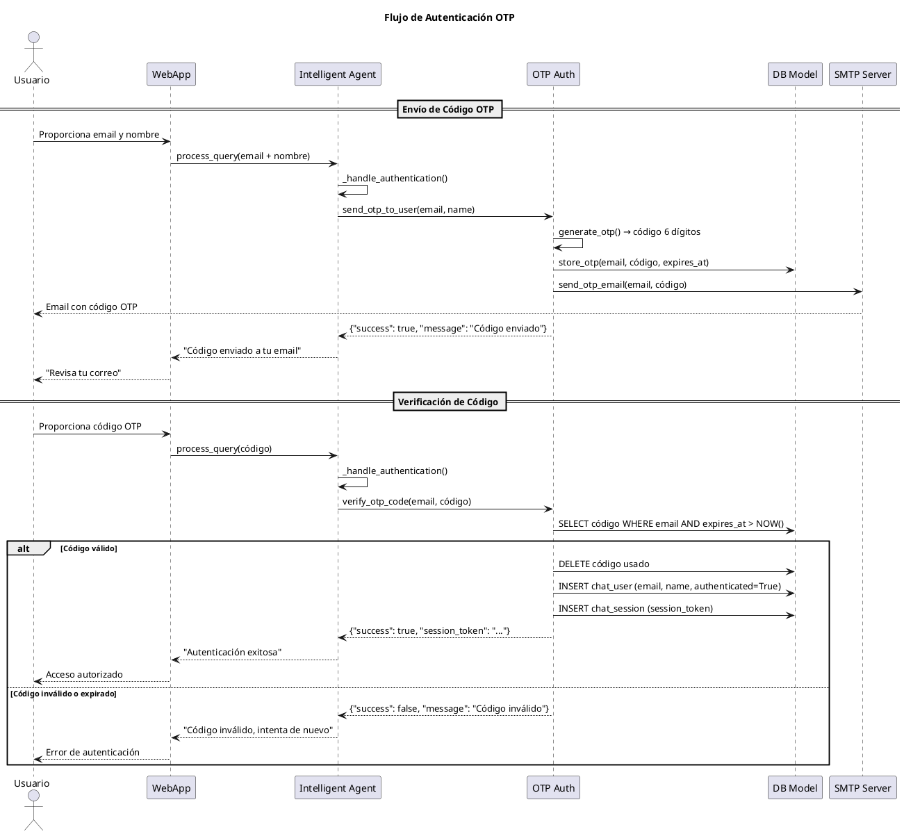
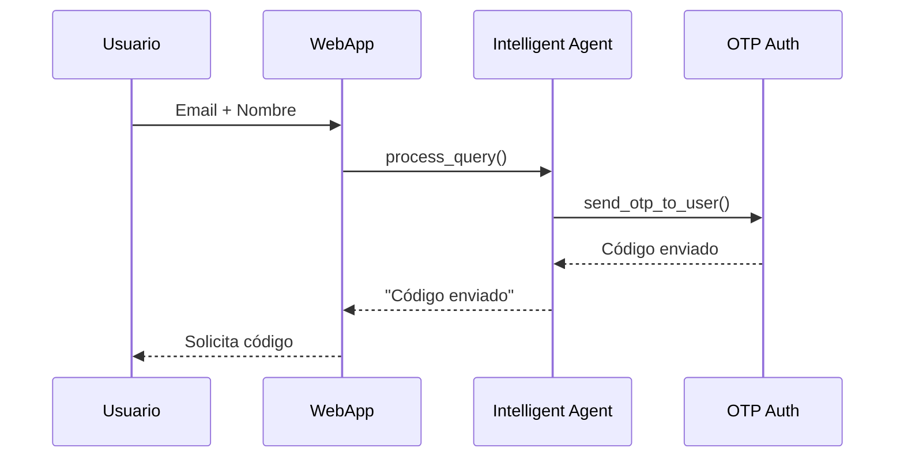
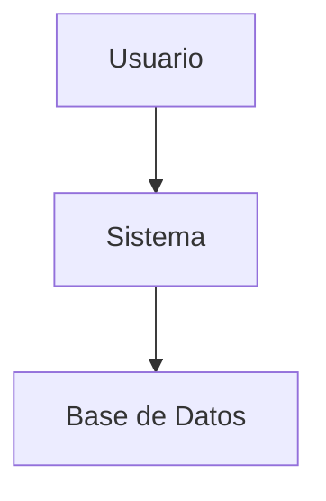

# 📐 Documentación para Diagramas de Arquitectura C4

## 📋 Índice

1. [Introducción al Modelo C4](#introducción-al-modelo-c4)
2. [Nivel 1: Diagrama de Contexto](#nivel-1-diagrama-de-contexto)
3. [Nivel 2: Diagrama de Contenedores](#nivel-2-diagrama-de-contenedores)
4. [Nivel 3: Diagrama de Componentes](#nivel-3-diagrama-de-componentes)
5. [Nivel 4: Diagrama de Código (Opcional)](#nivel-4-diagrama-de-código-opcional)
6. [Diagramas de Secuencia](#diagramas-de-secuencia)
7. [Herramientas para Generar Diagramas](#herramientas-para-generar-diagramas)
8. [Ejemplos de Implementación](#ejemplos-de-implementación)

---

## Introducción al Modelo C4

El modelo C4 es una técnica de modelado de arquitectura de software que utiliza 4 niveles de abstracción para describir un sistema:

1. **Context (Contexto)**: Muestra el sistema en el contexto de su entorno, incluyendo usuarios y sistemas externos.
2. **Container (Contenedores)**: Descompone el sistema en contenedores (aplicaciones, bases de datos, etc.).
3. **Component (Componentes)**: Descompone los contenedores en componentes principales.
4. **Code (Código)**: Muestra cómo están implementados los componentes (opcional, muy detallado).

### Beneficios del Modelo C4

- ✅ **Comunicación clara**: Facilita la comunicación entre stakeholders técnicos y no técnicos
- ✅ **Documentación viva**: Los diagramas pueden actualizarse fácilmente
- ✅ **Múltiples niveles**: Permite ver el sistema desde diferentes perspectivas
- ✅ **Estándar de la industria**: Ampliamente adoptado y reconocido

---

## Nivel 1: Diagrama de Contexto

### Descripción

El diagrama de contexto muestra el sistema de recomendación de posgrados ICESI en su entorno, identificando:
- **Usuarios**: Estudiantes prospectivos, administradores
- **Sistema principal**: Sistema de Recomendación de Posgrados ICESI
- **Sistemas externos**: OpenAI API, Servidor SMTP, Google OAuth, LangSmith

### Diagrama PlantUML

```plantuml
@startuml C4_Context
!include https://raw.githubusercontent.com/plantuml-stdlib/C4-PlantUML/master/C4_Context.puml

LAYOUT_WITH_LEGEND()

title Diagrama de Contexto - Sistema de Recomendación de Posgrados ICESI

Person(estudiante, "Estudiante Prospectivo", "Estudiante interesado en programas de posgrado de la Universidad ICESI")
Person(admin, "Administrador", "Personal administrativo que gestiona el sistema")

System(sistema_recomendacion, "Sistema de Recomendación de Posgrados ICESI", "Sistema inteligente que recomienda programas de posgrado basado en el perfil del estudiante")

System_Ext(openai, "OpenAI API", "Proveedor de servicios de IA: embeddings y LLM (GPT-4o-mini)")
System_Ext(smtp, "Servidor SMTP", "Servidor de correo electrónico para envío de códigos OTP")
System_Ext(google_oauth, "Google OAuth", "Servicio de autenticación de Google")
System_Ext(langsmith, "LangSmith", "Plataforma de observabilidad y trazabilidad para aplicaciones LLM (opcional)")

Rel(estudiante, sistema_recomendacion, "Consulta información sobre posgrados", "HTTPS")
Rel(admin, sistema_recomendacion, "Gestiona configuración y documentos", "HTTPS")
Rel(sistema_recomendacion, openai, "Obtiene embeddings y genera respuestas", "HTTPS/API")
Rel(sistema_recomendacion, smtp, "Envía códigos OTP por email", "SMTP")
Rel(sistema_recomendacion, google_oauth, "Autentica usuarios con Google", "OAuth 2.0")
Rel(sistema_recomendacion, langsmith, "Envía trazas y métricas", "HTTPS/API")

@enduml
```

### Diagrama Mermaid



### Descripción de Relaciones

| Actor | Sistema | Relación | Tecnología |
|-------|---------|----------|------------|
| Estudiante Prospectivo | Sistema de Recomendación | Consulta información sobre posgrados, responde entrevista | HTTPS/Streamlit |
| Administrador | Sistema de Recomendación | Gestiona configuración, documentos y usuarios | HTTPS/Streamlit |
| Sistema | OpenAI API | Obtiene embeddings y genera respuestas con LLM | HTTPS/REST API |
| Sistema | Servidor SMTP | Envía códigos OTP para autenticación | SMTP/TLS |
| Sistema | Google OAuth | Autentica usuarios con credenciales de Google | OAuth 2.0 |
| Sistema | LangSmith | Envía trazas y métricas de operaciones LLM | HTTPS/REST API |

---

## Nivel 2: Diagrama de Contenedores

### Descripción

El diagrama de contenedores descompone el sistema en sus contenedores principales:
- **Aplicación Web (Streamlit)**: Interfaz de usuario
- **API Backend (Python)**: Lógica de negocio y agentes
- **Base de Datos SQLite**: Almacenamiento de metadatos y sesiones
- **Base de Datos Vectorial (ChromaDB)**: Almacenamiento de embeddings y documentos
- **Sistema de Archivos**: Documentos fuente y archivos temporales

### Diagrama PlantUML

```plantuml
@startuml C4_Container
!include https://raw.githubusercontent.com/plantuml-stdlib/C4-PlantUML/master/C4_Container.puml

LAYOUT_WITH_LEGEND()

title Diagrama de Contenedores - Sistema de Recomendación de Posgrados ICESI

Person(estudiante, "Estudiante Prospectivo", "Usuario del sistema")
Person(admin, "Administrador", "Personal administrativo")

System_Boundary(sistema, "Sistema de Recomendación de Posgrados ICESI") {
    Container(web_app, "Aplicación Web", "Streamlit", "Interfaz de usuario para chat y administración")
    Container(backend, "Backend Python", "Python 3.13", "Lógica de negocio, agentes inteligentes y herramientas")
    ContainerDb(sqlite, "Base de Datos SQLite", "SQLite", "Almacena metadatos, sesiones, usuarios y mensajes")
    ContainerDb(chromadb, "Base de Datos Vectorial", "ChromaDB", "Almacena embeddings y documentos para RAG")
    Container(archivos, "Sistema de Archivos", "File System", "Documentos fuente, archivos temporales y persistencia")
}

System_Ext(openai, "OpenAI API", "Servicios de IA")
System_Ext(smtp, "Servidor SMTP", "Correo electrónico")
System_Ext(google_oauth, "Google OAuth", "Autenticación")
System_Ext(langsmith, "LangSmith", "Observabilidad")

Rel(estudiante, web_app, "Usa", "HTTPS")
Rel(admin, web_app, "Administra", "HTTPS")
Rel(web_app, backend, "Invoca", "Python API")
Rel(backend, sqlite, "Lee y escribe", "SQL")
Rel(backend, chromadb, "Consulta vectores", "ChromaDB API")
Rel(backend, archivos, "Lee y escribe", "File I/O")
Rel(backend, openai, "Obtiene embeddings y LLM", "HTTPS/REST")
Rel(backend, smtp, "Envía emails", "SMTP")
Rel(backend, google_oauth, "Autentica", "OAuth 2.0")
Rel(backend, langsmith, "Envía trazas", "HTTPS/REST")

@enduml
```

### Diagrama Mermaid



### Descripción de Contenedores

| Contenedor | Tecnología | Responsabilidad |
|------------|------------|-----------------|
| **Aplicación Web** | Streamlit | Interfaz de usuario, chat interactivo, panel de administración |
| **Backend Python** | Python 3.13 | Agentes inteligentes, herramientas, lógica de negocio, procesamiento RAG |
| **Base de Datos SQLite** | SQLite | Metadatos de documentos, sesiones de chat, usuarios, códigos OTP, mensajes |
| **Base de Datos Vectorial** | ChromaDB | Embeddings de documentos, búsqueda semántica, colecciones de documentos |
| **Sistema de Archivos** | File System | Documentos fuente (PDF, TXT, Excel), archivos temporales, persistencia de datos |

---

## Nivel 3: Diagrama de Componentes

### Descripción

El diagrama de componentes muestra la estructura interna del Backend Python, identificando:
- **Agentes**: Intelligent Agent, Interviewer Agent, Profiler Agent, Recommender Agent, RAG Agent
- **Herramientas**: OTP Auth, Google Auth, Document Retriever, Query Processor, Chat Memory
- **Modelos y Utilidades**: Base de datos, vector functions, tracing, theme utils

### Diagrama PlantUML

```plantuml
@startuml C4_Component
!include https://raw.githubusercontent.com/plantuml-stdlib/C4-PlantUML/master/C4_Component.puml

LAYOUT_WITH_LEGEND()

title Diagrama de Componentes - Backend Python

Container(web_app, "Aplicación Web", "Streamlit", "Interfaz de usuario")
ContainerDb(sqlite, "Base de Datos SQLite", "SQLite", "Metadatos")
ContainerDb(chromadb, "Base de Datos Vectorial", "ChromaDB", "Vectores")
System_Ext(openai, "OpenAI API", "IA")

Container_Boundary(backend, "Backend Python") {
    Component(intelligent_agent, "Intelligent Agent", "Python", "Coordina el flujo completo del sistema")
    Component(interviewer_agent, "Interviewer Agent", "Python", "Recopila información del estudiante mediante entrevista")
    Component(profiler_agent, "Profiler Agent", "Python", "Analiza perfil y calcula matches con programas")
    Component(recommender_agent, "Recommender Agent", "Python", "Genera recomendaciones personalizadas")
    Component(rag_agent, "RAG Agent", "Python", "Búsqueda semántica en documentos")
    
    Component(otp_auth, "OTP Auth", "Python", "Autenticación mediante códigos OTP")
    Component(google_auth, "Google Auth", "Python", "Autenticación con Google OAuth")
    Component(document_retriever, "Document Retriever", "Python", "Recupera documentos relevantes")
    Component(query_processor, "Query Processor", "Python", "Procesa y clasifica consultas")
    Component(chat_memory, "Chat Memory", "Python", "Gestiona memoria de conversación")
    
    Component(db_model, "DB Model", "Python", "Acceso a base de datos SQLite")
    Component(vector_functions, "Vector Functions", "Python", "Operaciones con ChromaDB")
    Component(tracing, "Tracing", "Python", "Sistema de trazabilidad")
}

Rel(web_app, intelligent_agent, "Invoca", "Python API")
Rel(intelligent_agent, interviewer_agent, "Usa", "Python")
Rel(intelligent_agent, profiler_agent, "Usa", "Python")
Rel(intelligent_agent, recommender_agent, "Usa", "Python")
Rel(recommender_agent, rag_agent, "Usa", "Python")
Rel(intelligent_agent, otp_auth, "Usa", "Python")
Rel(intelligent_agent, google_auth, "Usa", "Python")
Rel(rag_agent, document_retriever, "Usa", "Python")
Rel(rag_agent, query_processor, "Usa", "Python")
Rel(intelligent_agent, chat_memory, "Usa", "Python")
Rel(otp_auth, db_model, "Lee y escribe", "SQL")
Rel(google_auth, db_model, "Lee y escribe", "SQL")
Rel(chat_memory, db_model, "Lee y escribe", "SQL")
Rel(document_retriever, vector_functions, "Usa", "Python")
Rel(vector_functions, chromadb, "Consulta", "ChromaDB API")
Rel(vector_functions, openai, "Obtiene embeddings", "HTTPS/REST")
Rel(tracing, openai, "Envía trazas", "HTTPS/REST")

@enduml
```

### Diagrama Mermaid



### Descripción de Componentes

#### Agentes

| Componente | Responsabilidad | Archivo |
|------------|-----------------|---------|
| **Intelligent Agent** | Coordina el flujo completo: autenticación, entrevista, análisis y recomendación | `src/agents/intelligent_agent.py` |
| **Interviewer Agent** | Recopila información del estudiante mediante preguntas estructuradas | `src/agents/interviewer_agent.py` |
| **Profiler Agent** | Analiza el perfil del estudiante y calcula matches con programas | `src/agents/profiler_agent.py` |
| **Recommender Agent** | Genera recomendaciones personalizadas basadas en el análisis | `src/agents/recommender_agent.py` |
| **RAG Agent** | Realiza búsqueda semántica en documentos de programas | `src/agents/rag_agent.py` |

#### Herramientas

| Componente | Responsabilidad | Archivo |
|------------|-----------------|---------|
| **OTP Auth** | Genera y verifica códigos OTP para autenticación | `src/tools/otp_auth.py` |
| **Google Auth** | Maneja autenticación con Google OAuth | `src/tools/google_auth.py` |
| **Document Retriever** | Recupera documentos relevantes de ChromaDB | `src/tools/document_retriever.py` |
| **Query Processor** | Procesa y clasifica consultas del usuario | `src/tools/query_processor.py` |
| **Chat Memory** | Gestiona memoria de conversación y datos de sesión | `src/tools/chat_memory.py` |

#### Infraestructura

| Componente | Responsabilidad | Archivo |
|------------|-----------------|---------|
| **DB Model** | Acceso a base de datos SQLite (usuarios, sesiones, mensajes) | `src/models/db.py` |
| **Vector Functions** | Operaciones con ChromaDB y generación de embeddings | `src/utils/vector_functions.py` |
| **Tracing** | Sistema de trazabilidad y logging | `src/utils/tracing.py` |

---

## Nivel 4: Diagrama de Código (Opcional)

### Descripción

El nivel 4 muestra la estructura interna de un componente específico. Como ejemplo, mostraremos la estructura del **Intelligent Agent**.

### Diagrama PlantUML

```plantuml
@startuml C4_Code_IntelligentAgent
!include https://raw.githubusercontent.com/plantuml-stdlib/C4-PlantUML/master/C4_Component.puml

title Diagrama de Código - Intelligent Agent

Component_Boundary(intelligent_agent, "Intelligent Agent") {
    Component(process_query, "process_query()", "Python", "Método principal que procesa consultas")
    Component(get_session_state, "_get_session_state()", "Python", "Determina el estado de la sesión")
    Component(start_interview, "_start_interview()", "Python", "Inicia nueva entrevista")
    Component(continue_interview, "_continue_interview()", "Python", "Continúa entrevista en curso")
    Component(analyze_and_recommend, "_analyze_and_recommend()", "Python", "Analiza perfil y genera recomendación")
    Component(handle_authentication, "_handle_authentication()", "Python", "Maneja autenticación OTP")
    Component(answer_followup_question, "_answer_followup_question()", "Python", "Responde preguntas adicionales")
}

Component(interviewer_agent, "Interviewer Agent", "Python", "Recopila información")
Component(profiler_agent, "Profiler Agent", "Python", "Analiza perfil")
Component(recommender_agent, "Recommender Agent", "Python", "Genera recomendaciones")
Component(otp_auth, "OTP Auth", "Python", "Autenticación")

Rel(process_query, get_session_state, "Usa")
Rel(process_query, handle_authentication, "Usa")
Rel(process_query, start_interview, "Usa")
Rel(process_query, continue_interview, "Usa")
Rel(process_query, analyze_and_recommend, "Usa")
Rel(process_query, answer_followup_question, "Usa")
Rel(start_interview, interviewer_agent, "Invoca")
Rel(continue_interview, interviewer_agent, "Invoca")
Rel(analyze_and_recommend, profiler_agent, "Invoca")
Rel(analyze_and_recommend, recommender_agent, "Invoca")
Rel(handle_authentication, otp_auth, "Usa")

@enduml
```

---

## Diagramas de Secuencia

### Flujo Completo: Consulta de Estudiante

Este diagrama muestra el flujo completo desde que un estudiante hace una consulta hasta que recibe una recomendación.

#### PlantUML



#### Mermaid



### Flujo de Autenticación OTP



---

## Herramientas para Generar Diagramas

### 1. PlantUML

**Descripción**: Lenguaje de modelado basado en texto que genera diagramas UML.

**Instalación**:
```bash
# Opción 1: Instalar Java y PlantUML
brew install plantuml  # macOS
# o
sudo apt-get install plantuml  # Linux

# Opción 2: Usar servidor web
# Visitar: http://www.plantuml.com/plantuml/uml/
```

**Uso**:
1. Crear archivo `.puml` con el código PlantUML
2. Generar diagrama:
   ```bash
   plantuml diagrama.puml
   ```
3. O usar extensiones de VS Code: "PlantUML"

**Ventajas**:
- ✅ Código versionable
- ✅ Fácil de mantener
- ✅ Integración con Git
- ✅ Soporte para C4

### 2. Mermaid

**Descripción**: Lenguaje de diagramación basado en texto, muy popular en GitHub.

**Instalación**:
```bash
npm install -g @mermaid-js/mermaid-cli
```

**Uso**:
1. Crear archivo `.mmd` con código Mermaid
2. Generar diagrama:
   ```bash
   mmdc -i diagrama.mmd -o diagrama.png
   ```
3. O usar en Markdown (GitHub lo renderiza automáticamente)

**Ventajas**:
- ✅ Renderizado nativo en GitHub
- ✅ Sintaxis simple
- ✅ Múltiples tipos de diagramas

### 3. Structurizr

**Descripción**: Herramienta comercial especializada en diagramas C4.

**Instalación**:
```bash
# CLI
npm install -g @structurizr/cli

# O usar versión web: https://structurizr.com/
```

**Uso**:
```bash
structurizr export -workspace workspace.dsl -format plantuml
```

**Ventajas**:
- ✅ Especializado en C4
- ✅ Herramientas profesionales
- ✅ Soporte para múltiples formatos

### 4. Draw.io / diagrams.net

**Descripción**: Herramienta visual para crear diagramas.

**Uso**:
1. Visitar: https://app.diagrams.net/
2. Crear diagrama visualmente
3. Exportar como PNG, SVG, etc.

**Ventajas**:
- ✅ Interfaz visual intuitiva
- ✅ No requiere código
- ✅ Colaboración en tiempo real

---

## Ejemplos de Implementación

### Ejemplo 1: Generar Diagrama de Contexto con PlantUML

1. Crear archivo `C4_Context.puml`:

```plantuml
@startuml C4_Context
!include https://raw.githubusercontent.com/plantuml-stdlib/C4-PlantUML/master/C4_Context.puml

LAYOUT_WITH_LEGEND()

title Diagrama de Contexto - Sistema de Recomendación de Posgrados ICESI

Person(estudiante, "Estudiante Prospectivo", "Estudiante interesado en programas de posgrado")
System(sistema, "Sistema de Recomendación de Posgrados ICESI", "Sistema inteligente de recomendación")
System_Ext(openai, "OpenAI API", "Servicios de IA")

Rel(estudiante, sistema, "Consulta información", "HTTPS")
Rel(sistema, openai, "Obtiene embeddings y LLM", "HTTPS/API")

@enduml
```

2. Generar diagrama:
```bash
plantuml C4_Context.puml
```

3. Resultado: `C4_Context.png`

### Ejemplo 2: Generar Diagrama de Secuencia con Mermaid

1. Crear archivo `sequence_auth.mmd`:



2. Generar diagrama:
```bash
mmdc -i sequence_auth.mmd -o sequence_auth.png
```

### Ejemplo 3: Integrar Diagramas en Documentación

Los diagramas Mermaid se pueden incluir directamente en Markdown:

```markdown
## Arquitectura del Sistema



GitHub renderiza automáticamente los diagramas Mermaid en archivos `.md`.
```

---

## Estructura de Archivos Recomendada

```
DOCs/
├── C4_ARCHITECTURE_DIAGRAMS.md          # Este documento
├── diagrams/
│   ├── C4_Context.puml                 # Diagrama de contexto (PlantUML)
│   ├── C4_Container.puml                # Diagrama de contenedores (PlantUML)
│   ├── C4_Component.puml                # Diagrama de componentes (PlantUML)
│   ├── sequence_complete.mmd             # Flujo completo (Mermaid)
│   ├── sequence_auth.mmd                 # Flujo de autenticación (Mermaid)
│   └── generated/                       # Diagramas generados (PNG/SVG)
│       ├── C4_Context.png
│       ├── C4_Container.png
│       ├── C4_Component.png
│       ├── sequence_complete.png
│       └── sequence_auth.png
└── README_DIAGRAMS.md                    # Guía rápida de uso
```

---

## Scripts de Automatización

### Script para Generar Todos los Diagramas (Bash)

```bash
#!/bin/bash
# generate_diagrams.sh

echo "Generando diagramas C4..."

# PlantUML
if command -v plantuml &> /dev/null; then
    echo "Generando diagramas PlantUML..."
    plantuml DOCs/diagrams/*.puml -o generated
else
    echo "PlantUML no está instalado. Instala con: brew install plantuml"
fi

# Mermaid
if command -v mmdc &> /dev/null; then
    echo "Generando diagramas Mermaid..."
    for file in DOCs/diagrams/*.mmd; do
        mmdc -i "$file" -o "DOCs/diagrams/generated/$(basename "$file" .mmd).png"
    done
else
    echo "Mermaid CLI no está instalado. Instala con: npm install -g @mermaid-js/mermaid-cli"
fi

echo "¡Diagramas generados en DOCs/diagrams/generated/"
```

### Script Python para Validar Diagramas

```python
#!/usr/bin/env python3
"""
Script para validar que los diagramas estén actualizados
"""
import os
import subprocess
from pathlib import Path

def check_plantuml():
    """Verificar si PlantUML está instalado"""
    try:
        subprocess.run(['plantuml', '-version'], 
                      capture_output=True, check=True)
        return True
    except (subprocess.CalledProcessError, FileNotFoundError):
        return False

def check_mermaid():
    """Verificar si Mermaid CLI está instalado"""
    try:
        subprocess.run(['mmdc', '--version'], 
                      capture_output=True, check=True)
        return True
    except (subprocess.CalledProcessError, FileNotFoundError):
        return False

def main():
    print("Verificando herramientas de diagramación...")
    
    plantuml_ok = check_plantuml()
    mermaid_ok = check_mermaid()
    
    print(f"PlantUML: {'✓ Instalado' if plantuml_ok else '✗ No instalado'}")
    print(f"Mermaid CLI: {'✓ Instalado' if mermaid_ok else '✗ No instalado'}")
    
    if not plantuml_ok:
        print("\nPara instalar PlantUML:")
        print("  macOS: brew install plantuml")
        print("  Linux: sudo apt-get install plantuml")
    
    if not mermaid_ok:
        print("\nPara instalar Mermaid CLI:")
        print("  npm install -g @mermaid-js/mermaid-cli")

if __name__ == "__main__":
    main()
```

---

## Mejores Prácticas

### 1. Mantener Diagramas Actualizados

- ✅ Actualizar diagramas cuando cambie la arquitectura
- ✅ Incluir diagramas en revisiones de código
- ✅ Usar versionado (Git) para los archivos fuente

### 2. Nivel de Detalle Apropiado

- ✅ **Contexto**: Alto nivel, para stakeholders no técnicos
- ✅ **Contenedores**: Para arquitectos y desarrolladores senior
- ✅ **Componentes**: Para desarrolladores del equipo
- ✅ **Código**: Solo cuando sea necesario (muy detallado)

### 3. Nomenclatura Consistente

- ✅ Usar nombres descriptivos y consistentes
- ✅ Seguir convenciones del proyecto
- ✅ Documentar acrónimos y abreviaciones

### 4. Colores y Estilos

- ✅ Usar colores consistentes en todos los diagramas
- ✅ Diferenciar tipos de componentes con colores
- ✅ Usar leyendas cuando sea necesario

---

## Referencias

- [Modelo C4 - Simon Brown](https://c4model.com/)
- [C4-PlantUML](https://github.com/plantuml-stdlib/C4-PlantUML)
- [Mermaid Documentation](https://mermaid.js.org/)
- [Structurizr](https://structurizr.com/)
- [PlantUML Documentation](https://plantuml.com/)

---

## Conclusión

Esta documentación proporciona una guía completa para generar diagramas de arquitectura C4 del Sistema de Recomendación de Posgrados ICESI. Los diagramas ayudan a:

- 📊 **Comunicar** la arquitectura a diferentes audiencias
- 🔍 **Documentar** el sistema de manera clara y estructurada
- 🛠️ **Mantener** la arquitectura actualizada
- 🎯 **Planificar** mejoras y cambios futuros

Para cualquier pregunta o actualización, consulta la documentación del proyecto o contacta al equipo de desarrollo.

