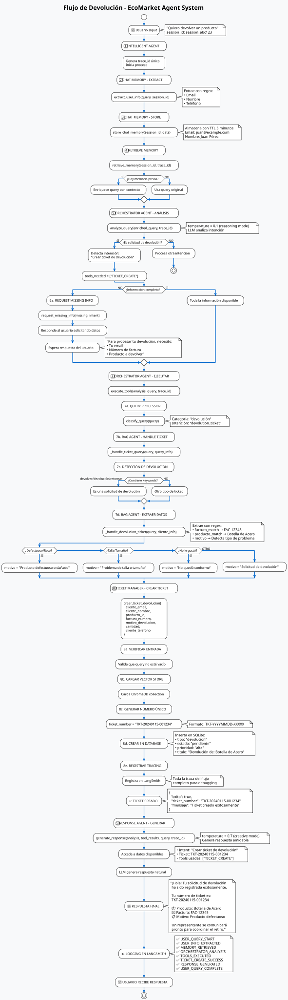

# FASE 1: Análisis de Herramientas del Agente EcoMarket

## 📋 Introducción

El sistema EcoMarket utiliza un **sistema multi-agente** que integra múltiples herramientas especializadas para responder consultas de clientes. Este documento identifica y documenta cada herramienta, cómo reciben información y qué tipo de respuestas devuelven.

---

## 🛠️ HERRAMIENTAS DEL SISTEMA

### 1. **DocumentRetriever** - Búsqueda RAG en Documentos

**Ubicación**: `src/tools/document_retriever.py`

#### Cómo recibe información
```python
def search(query: str) -> list:
    """
    Busca documentos relevantes para una consulta
    
    Args:
        query (str): Consulta del usuario en texto libre
    """
```

**Parámetros de entrada**:
- `query`: Texto de la consulta del usuario (ej: "¿Cuál es la política de devoluciones?")
- `max_documents`: Número máximo de documentos a recuperar (default: 10)

#### Tipo de respuesta
```python
[
    {
        "rank": 1,
        "source": "politica_devoluciones.txt",
        "file_type": "txt",
        "content": "Texto completo del documento...",
        "content_preview": "Primeros 200 caracteres...",
        "relevance_score": 0.85
    },
    # ... más documentos
]
```

**Características**:
- Usa búsqueda semántica en ChromaDB
- Retorna documentos con metadata y score de relevancia
- Filtra por archivos de inventario vs documentos generales
- Limita resultados a `max_documents`

---

### 2. **ProductChecker** - Verificación de Productos en Inventario

**Ubicación**: `src/tools/product_checker.py`

#### Cómo recibe información
```python
def check_product_existence(
    query: str,
    search_type: str = "producto",
    categoria_filtro: Optional[str] = None,
    precio_min: Optional[float] = None,
    precio_max: Optional[float] = None,
    umbral_similitud: float = 0.7
) -> Dict[str, Any]:
```

**Parámetros de entrada**:
- `query`: Nombre del producto a buscar (ej: "Botella de acero")
- `search_type`: Tipo de búsqueda:
  - `"producto"`: Búsqueda individual
  - `"lista"`: Búsqueda de múltiples productos
  - `"categoria"`: Por categoría
  - `"precio"`: Por rango de precio
  - `"todas_categorias"`: Lista todas las categorías
  - `"todos_productos"`: Lista todos los productos
- `categoria_filtro`: Filtrar por categoría específica
- `precio_min/max`: Rango de precios
- `umbral_similitud`: Score mínimo (default: 0.7)

#### Tipo de respuesta

**Para búsqueda individual** (`search_type="producto"`):
```python
{
    "existe": True,
    "producto_nombre": "Botella de Acero",
    "categoria": "Hogar",
    "cantidad": "50",
    "precio": "$25.00",
    "similitud": 0.92,
    "mensaje": "Producto encontrado con similitud 0.92",
    "detalles": {
        "producto_nombre": "Botella de Acero",
        "categoria": "Hogar",
        "cantidad": "50",
        "precio": "$25.00",
        "similitud": 0.92,
        "content": "Texto del documento..."
    },
    "matches_alternativos": [
        {
            "producto_nombre": "Botella de Acero Inoxidable",
            "categoria": "Hogar",
            "cantidad": "30",
            "precio": "$28.00",
            "similitud": 0.88
        }
    ]
}
```

**Si no existe**:
```python
{
    "existe": False,
    "producto_nombre": "Producto no encontrado",
    "mensaje": "No se encontró producto con similitud >= 0.7"
}
```

**Para búsqueda por categoría** (`search_type="categoria"`):
```python
{
    "categoria": "Hogar",
    "productos": [
        {
            "nombre": "Botella de Acero",
            "cantidad": "50",
            "precio": "$25.00",
            "categoria": "Hogar"
        },
        # ... más productos
    ],
    "total": 15
}
```

**Características**:
- Usa búsqueda semántica con embeddings
- Convierte distancia a score de similitud (0-1)
- Filtra automáticamente archivos de inventario (Excel)
- Parse de metadata automático
- Retorna múltiples matches con scores

---

### 3. **TicketManager** - Gestión de Tickets

**Ubicación**: `src/tools/ticket_manager.py`

#### Cómo recibe información

**Crear ticket de devolución**:
```python
def crear_ticket_devolucion(
    cliente_email: str,
    cliente_nombre: str,
    producto_id: str,
    factura_numero: str,
    motivo_devolucion: str,
    cantidad: int = 1,
    cliente_telefono: str = None,
    fecha_devolucion: str = None,
    notas: str = None
) -> Dict[str, Any]:
```

**Crear ticket de compra**:
```python
def crear_ticket_compra(
    cliente_email: str,
    cliente_nombre: str,
    productos: str,
    total: float,
    cliente_telefono: str = None,
    notas: str = None
) -> Dict[str, Any]:
```

**Consultar ticket**:
```python
def consultar_ticket(
    ticket_number: str = None,
    cliente_email: str = None,
    estado: str = None,
    tipo: str = None
) -> Dict[str, Any]:
```

**Otras funciones**:
- `generar_guia_de_seguimiento()` - Generar guía de envío
- `consulta_seguimiento()` - Consultar estado de envío
- `obtener_factura()` - Obtener información de factura
- `crear_ticket_queja_reclamo()` - Crear queja/reclamo
- `generar_etiqueta_devolucion()` - Generar etiqueta de retiro
- `extraer_info_cliente()` - Extraer email, teléfono, nombre

#### Tipo de respuesta

**Ticket creado exitosamente**:
```python
{
    "exito": True,
    "ticket_number": "TKT-20240115-001234",
    "mensaje": "Ticket de devolución creado exitosamente. Su número de ticket es: TKT-20240115-001234",
    "instrucciones": "Su solicitud ha sido registrada. Un representante se comunicará con usted pronto."
}
```

**Ticket consultado**:
```python
{
    "exito": True,
    "total": 1,
    "mensaje": "Ticket TKT-20240115-001234 encontrado",
    "tickets": [
        {
            "numero": "TKT-20240115-001234",
            "tipo": "devolucion",
            "estado": "pendiente",
            "prioridad": "alta",
            "titulo": "Devolución de producto: Botella de Acero",
            "descripcion": "Cliente solicita devolución...",
            "cliente": {
                "nombre": "Juan Pérez",
                "email": "juan@example.com",
                "telefono": "+57 300 123 4567"
            },
            "producto_id": "Botella de Acero",
            "factura_numero": "FAC-12345",
            "cantidad": "1",
            "fecha_creacion": "2024-01-15 10:30:00",
            "fecha_actualizacion": "2024-01-15 10:30:00"
        }
    ]
}
```

**Error**:
```python
{
    "exito": False,
    "error": "Error de base de datos",
    "mensaje": "Hubo un error al crear el ticket"
}
```

**Características**:
- Genera números de ticket únicos
- Almacena en base de datos SQLite
- Formatea respuestas amigables
- Tracking completo con tracing
- Extrae información de cliente automáticamente

---

### 4. **QueryProcessor** - Procesamiento y Clasificación de Consultas

**Ubicación**: `src/tools/query_processor.py`

#### Cómo recibe información
```python
def classify_query(query: str) -> Dict[str, Any]:
    """
    Clasificar una consulta del usuario
    
    Args:
        query (str): Consulta del usuario
    """
```

**Parámetros de entrada**:
- `query`: Texto de la consulta en lenguaje natural

#### Tipo de respuesta
```python
{
    "category": "producto",
    "is_list_query": False,
    "urgency": "normal",
    "intention": "info",
    "original_query": "¿Tienen botellas de acero?",
    "processed_query": "¿tienen botellas de acero?"
}
```

**Campos de la respuesta**:
- `category`: Categoría detectada:
  - `"producto"`: Sobre productos/inventario
  - `"precio"`: Sobre precios
  - `"contacto"`: Información de contacto
  - `"devolución"`: Sobre devoluciones
  - `"envío"`: Sobre envíos
  - `"general"`: Consulta general
- `is_list_query`: True si pide una lista
- `urgency`: Nivel de urgencia (`"urgent"`, `"high"`, `"normal"`)
- `intention`: Intención del usuario:
  - `"buy"`: Quiere comprar
  - `"track"`: Rastrear pedido
  - `"support"`: Necesita soporte
  - `"info"`: Busca información
  - `"general"`: General

**Funciones adicionales**:
```python
def extract_entities(query: str) -> List[Dict[str, str]]:
    """Extraer entidades (productos, números) de la consulta"""
    # Retorna: [
    #     {"type": "product", "value": "Botella de Acero"},
    #     {"type": "number", "value": "25.00"}
    # ]

def generate_search_queries(query: str) -> List[str]:
    """Generar variaciones de la consulta para mejor búsqueda"""
    # Retorna: ["¿tienen botellas de acero?", 
    #           "¿tienen botellas de acero con precios?",
    #           "productos relacionados con botellas de acero"]
```

**Características**:
- Clasificación automática por keywords
- Detección de intención del usuario
- Genera variaciones de consultas
- Extrae entidades relevantes
- Historial de consultas

---

### 5. **ChatMemory** - Gestión de Memoria de Sesión

**Ubicación**: `src/tools/chat_memory.py`

#### Cómo recibe información

**Almacenar memoria**:
```python
def store_chat_memory(
    session_id: str,
    memory_key: str,
    memory_value: str,
    ttl_minutes: int = 5,
    trace_id: str = None
) -> Dict[str, Any]:
```

**Parámetros de entrada**:
- `session_id`: ID único de la sesión
- `memory_key`: Clave de la memoria (ej: "nombre", "email", "preferencia")
- `memory_value`: Valor a almacenar
- `ttl_minutes`: Tiempo de vida en minutos (default: 5)

#### Tipo de respuesta

**Memoria almacenada**:
```python
{
    "success": True,
    "message": "Memoria 'nombre' almacenada exitosamente",
    "session_id": "session_abc123",
    "memory_key": "nombre",
    "ttl_minutes": 5,
    "value_preview": "Juan Pérez"
}
```

**Recuperar memoria**:
```python
def retrieve_chat_memory(
    session_id: str,
    memory_key: Optional[str] = None,
    trace_id: str = None
) -> Dict[str, Any]:
```

**Respuesta con key específica**:
```python
{
    "success": True,
    "found": True,
    "memory_key": "nombre",
    "memory_value": "Juan Pérez",
    "preview": "Juan Pérez"
}
```

**Respuesta sin key (todas las memorias)**:
```python
{
    "success": True,
    "found": True,
    "memories": {
        "nombre": "Juan Pérez",
        "email": "juan@example.com",
        "telefono": "+57 300 1234567"
    },
    "count": 3
}
```

**Función especial de extracción**:
```python
def extract_user_info(query: str, session_id: str = None, trace_id: str = None) -> Dict[str, Any]:
    """
    Extraer información del usuario de la consulta y almacenarla
    
    Args:
        query: "Mi nombre es Juan Pérez y mi email es juan@example.com"
    
    Returns:
        {
            "session_id": "session_abc123",
            "extracted": {
                "nombre": "Juan Pérez",
                "email": "juan@example.com"
            },
            "count": 2
        }
    """
```

**Obtener contexto**:
```python
def get_context_for_query(session_id: str, trace_id: str = None) -> str:
    """
    Obtener contexto de memoria para enriquecer la consulta
    
    Returns:
        "\n\nContexto de la sesión:\nnombre: Juan Pérez\nemail: juan@example.com"
    """
```

**Características**:
- Almacena información temporal con TTL (5 minutos por defecto)
- Extrae automáticamente: nombre, email, teléfono
- Enriquece consultas con contexto previo
- Integrado con sistema de tracing
- Filtrado de TTL automático

---

## 🔄 INTEGRACIÓN DE HERRAMIENTAS EN EL FLUJO

### Flujo Completo de Procesamiento

```
1. Usuario: "¿Tienen botellas de acero?"
   ↓
2. Intelligent Agent recibe la consulta
   ↓
3. Orchestrator Agent analiza con LLM
   - Decide: usar PRODUCT_SEARCH
   ↓
4. ProductChecker.check_product_existence()
   - Parámetros: query="botellas de acero", search_type="producto"
   - Retorna: {"existe": True, "precio": "$25.00", ...}
   ↓
5. Response Agent genera respuesta amigable
   ↓
6. Usuario recibe: "¡Sí! Tenemos Botellas de Acero..."
```

### Ejemplo Completo: Creación de Ticket

```
1. Usuario: "Quiero devolver un producto"
   ↓
2. Orchestrator detecta: TICKET_CREATE
   - Analiza que falta información
   ↓
3. ChatMemory.extract_user_info()
   - Almacena: {"nombre": "Juan", "email": "juan@..."}
   ↓
4. Response Agent pide información faltante:
   "Necesito: email, factura, producto"
   ↓
5. Usuario: "Email juan@example.com, factura 12345"
   ↓
6. ChatMemory actualiza memoria
   ↓
7. TicketManager.crear_ticket_devolucion()
   - Parámetros: cliente_email, factura_numero, ...
   - Retorna: {"ticket_number": "TKT-..."}
   ↓
8. Response Agent: "Tu ticket TKT-12345 ha sido creado"
```

---

## 📊 RESUMEN DE HERRAMIENTAS

| Herramienta | Entrada Principal | Salida Principal | Función |
|-------------|-------------------|------------------|---------|
| **DocumentRetriever** | `query: str` | `List[documentos]` | Búsqueda RAG en documentos |
| **ProductChecker** | `query, search_type, filtros` | `Dict[producto info]` | Verificar productos en inventario |
| **TicketManager** | `datos_cliente, tipo_ticket` | `Dict[ticket_info]` | Crear/consultar tickets |
| **QueryProcessor** | `query: str` | `Dict[categoría, intención]` | Clasificar consultas |
| **ChatMemory** | `session_id, key, value` | `Dict[memoria]` | Almacenar/recuperar contexto |

---

## 🎯 CARACTERÍSTICAS COMUNES

Todas las herramientas comparten:
1. **Tracing integrado**: Registran todas las operaciones
2. **Manejo de errores**: Retornan dicts con `error`/`success`
3. **Logging**: Usan `tracer.log()` para auditoría
4. **Type hints**: Tipado completo en Python
5. **Documentación**: Docstrings detallados
6. **LangSmith integration**: Decorador `@traceable`

---

## 📝 NOTAS IMPORTANTES

1. **Memoria con TTL**: ChatMemory elimina datos después de 5 minutos automáticamente
2. **Búsqueda semántica**: ProductChecker usa embeddings para encontrar productos similares
3. **Score de similitud**: ProductChecker retorna score 0-1 (mayor = más similar)
4. **Filtrado automático**: ProductChecker solo busca en archivos Excel/inventario
5. **Números de ticket únicos**: Generados con formato `TKT-{fecha}-{numero}`

---

## 🔍 EJEMPLOS DE USO

### Ejemplo 1: Búsqueda de Producto
```python
from tools.product_checker import check_product_existence

result = check_product_existence(
    query="botellas de acero",
    search_type="producto",
    umbral_similitud=0.7
)

# result = {
#     "existe": True,
#     "producto_nombre": "Botella de Acero",
#     "precio": "$25.00",
#     "cantidad": "50"
# }
```

### Ejemplo 2: Crear Ticket
```python
from tools.ticket_manager import crear_ticket_devolucion

result = crear_ticket_devolucion(
    cliente_email="juan@example.com",
    cliente_nombre="Juan Pérez",
    producto_id="Botella de Acero",
    factura_numero="FAC-12345",
    motivo_devolucion="Producto defectuoso"
)

# result = {
#     "exito": True,
#     "ticket_number": "TKT-20240115-001234"
# }
```

### Ejemplo 3: Almacenar Memoria
```python
from tools.chat_memory import store_chat_memory

result = store_chat_memory(
    session_id="session_abc123",
    memory_key="nombre",
    memory_value="Juan Pérez",
    ttl_minutes=5
)

# result = {
#     "success": True,
#     "message": "Memoria almacenada exitosamente"
# }
```

---

## 📊 PLANIFICACIÓN DEL FLUJO DE TRABAJO: PROCESO DE DEVOLUCIÓN

### 🎯 Objetivo
Diseñar un diagrama de flujo detallado del proceso de devolución que muestre las decisiones del agente y las llamadas a las herramientas.

### 🔄 Diagrama de Flujo del Proceso de Devolución



#### Diagrama Detallado (Textual)

```
┌─────────────────────────────────────────────────────────────────┐
│                  1. ENTRADA DE USUARIO                          │
│  Usuario: "Quiero devolver un producto"                          │
└────────────────────────────┬──────────────────────────────────┘
                              ↓
┌─────────────────────────────────────────────────────────────────┐
│        2. INTELLIGENT AGENT (Coordinador)                       │
│           process_query(query, session_id)                       │
│           - Genera trace_id único                               │
└────────────────────────────┬──────────────────────────────────┘
                              ↓
┌─────────────────────────────────────────────────────────────────┐
│     3. GESTIÓN DE MEMORIA DE SESIÓN (ChatMemory)                │
│        store_user_info(session_id, query, trace_id)            │
│                                                                  │
│        ACCIÓN: Extrae información del usuario                   │
│        - Email: de query con regex                              │
│        - Nombre: de query con patrones                          │
│        - Teléfono: de query con regex                          │
│        - Almacena con TTL de 5 minutos                         │
└────────────────────────────┬──────────────────────────────────┘
                              ↓
┌─────────────────────────────────────────────────────────────────┐
│        4. RETRIEVE MEMORY (Recuperar contexto)                 │
│        retrieve_memory(session_id, trace_id)                    │
│                                                                  │
│        SI hay memoria previa:                                  │
│          - Enriquece query con contexto de sesión              │
│        SI no hay memoria:                                      │
│          - Query original sin enriquecer                       │
└────────────────────────────┬──────────────────────────────────┘
                              ↓
┌─────────────────────────────────────────────────────────────────┐
│   5. ORCHESTRATOR AGENT - ANÁLISIS (Reasoning)                  │
│      analyze_query(enriched_query, trace_id)                   │
│                                                                  │
│      DECISIÓN DEL AGENTE:                                       │
│      - Analiza con LLM (temperature=0.1)                      │
│      - Detecta intención: "Crear ticket de devolución"         │
│      - Determina herramientas: ["TICKET_CREATE"]              │
│      - Extrae entidades: producto, factura, motivo            │
│                                                                  │
│      RESULTADO:                                                 │
│      {                                                          │
│        "intent": "Crear ticket de devolución",                 │
│        "tools_needed": ["TICKET_CREATE"],                      │
│        "requires_additional_info": true/false,                 │
│        "missing_info": ["email", "factura"]                    │
│      }                                                          │
└────────────────────────────┬──────────────────────────────────┘
                              ↓
                    ┌─────────┴─────────┐
                    │                   │
          ¿Necesita info?    No necesita info
                    │                   │
                    ↓                   ↓
┌───────────────────────────────────┐   │
│  6a. SOLICITAR INFORMACIÓN         │   │
│  request_missing_info(missing,     │   │
│                       intent)      │   │
│                                    │   │
│  RESPUESTA AL USUARIO:             │   │
│  "Para procesar tu devolución,    │   │
│   necesito:                        │   │
│   - Tu email                       │   │
│   - Número de factura             │   │
│   - Producto a devolver"          │   │
└───────────┬───────────────────────┘   │
            │                           ↓
            └─────── Esperar respuesta ──┘
                              ↓
┌─────────────────────────────────────────────────────────────────┐
│   7. ORCHESTRATOR AGENT - EJECUTAR HERRAMIENTAS                 │
│      execute_tools(analysis, query, trace_id)                  │
│                                                                  │
│      PARA CADA HERRAMIENTA EN tools_needed:                     │
│                                                                  │
│      IF TICKET_CREATE:                                          │
│        ↓                                                         │
│        ┌──────────────────────────────────────────┐             │
│        │ QueryProcessor.classify_query()          │             │
│        │ - Detecta categoría: "devolución"        │             │
│        │ - Extrae intención: "buy" o "track"     │             │
│        └────────────────┬─────────────────────────┘            │
│                         ↓                                       │
│        ┌──────────────────────────────────────────┐             │
│        │ RAGAgent._handle_ticket_query()         │             │
│        │                                          │             │
│        │ PASO 1: Detectar si es devolución       │             │
│        │   - Busca keywords: "devolver",         │             │
│        │     "devolución", "retornar"            │             │
│        └────────────────┬─────────────────────────┘            │
│                         ↓                                       │
│        ┌──────────────────────────────────────────┐             │
│        │ RAGAgent._handle_devolucion_ticket()    │             │
│        │                                          │             │
│        │ EXTRACCIÓN DE INFORMACIÓN (Regex):      │             │
│        │ - factura_match: busca "factura : X"   │             │
│        │   factura_numero = "FAC-12345"          │             │
│        │                                          │             │
│        │ - producto_match: busca "producto X"   │             │
│        │   producto_id = "Botella de Acero"      │             │
│        │                                          │             │
│        │ - motivo: detecta tipo de problema      │             │
│        │   IF "defectuoso" → motivo="Producto    │             │
│        │                        defectuoso"    │             │
│        │   ELIF "talla" → motivo="Problema de   │             │
│        │                    talla"              │             │
│        │   ELSE → motivo="Solicitud de devolución"│           │
│        └────────────────┬─────────────────────────┘            │
│                         ↓                                       │
└────────────────────────────────────────────────────────────────┘
                         ↓
┌─────────────────────────────────────────────────────────────────┐
│      8. CREAR TICKET DE DEVOLUCIÓN (TicketManager)             │
│      crear_ticket_devolucion(                                  │
│        cliente_email=cliente_info.get('email'),                │
│        cliente_nombre=cliente_info.get('nombre'),              │
│        producto_id="Botella de Acero",                         │
│        factura_numero="FAC-12345",                            │
│        motivo_devolucion="Producto defectuoso",               │
│        cantidad=1,                                             │
│        cliente_telefono=cliente_info.get('telefono')           │
│      )                                                         │
│                                                                 │
│      PROCESO INTERNO:                                          │
│      1. Verifica que query no esté vacío                      │
│      2. Carga colección de ChromaDB                           │
│      3. Genera número de ticket único:                         │
│         "TKT-20240115-001234"                                  │
│      4. Crea ticket en SQLite con:                            │
│         - tipo: "devolucion"                                   │
│         - estado: "pendiente"                                  │
│         - prioridad: "alta"                                   │
│         - titulo: "Devolución de producto: Botella de Acero"  │
│      5. Registra tracing en LangSmith                         │
│                                                                 │
│      RESULTADO:                                                 │
│      {                                                          │
│        "exito": true,                                          │
│        "ticket_number": "TKT-20240115-001234",                 │
│        "mensaje": "Ticket de devolución creado exitosamente", │
│        "instrucciones": "Un representante se comunicará..."   │
│      }                                                          │
└────────────────────────────┬──────────────────────────────────┘
                              ↓
┌─────────────────────────────────────────────────────────────────┐
│      9. RESPONSE AGENT - GENERAR RESPUESTA                      │
│      generate_response(analysis, tool_results, query, trace_id) │
│                                                                  │
│      LLM (temperature=0.7): Genera respuesta amigable          │
│                                                                  │
│      PROMPT:                                                    │
│      "Eres Luna, asistente de EcoMarket. Usa los datos          │
│       recuperados para generar una respuesta amigable."         │
│                                                                  │
│      DATOS DISPONIBLES:                                        │
│      - Intent: "Crear ticket de devolución"                   │
│      - Ticket creado: TKT-20240115-001234                      │
│      - Herramientas: ["TICKET_CREATE"]                        │
│                                                                 │
│      RESPUESTA GENERADA:                                        │
│      "¡Hola! Tu solicitud de devolución ha sido registrada     │
│       exitosamente. Tu número de ticket es:                   │
│       TKT-20240115-001234.                                     │
│                                                                 │
│       📦 Producto: Botella de Acero                            │
│       📄 Factura: FAC-12345                                     │
│       📋 Motivo: Producto defectuoso                            │
│                                                                 │
│       Un representante se comunicará contigo pronto para       │
│       coordinar el retiro del producto."                       │
└────────────────────────────┬──────────────────────────────────┘
                              ↓
┌─────────────────────────────────────────────────────────────────┐
│                  10. RESPUESTA FINAL                            │
│        Usuario recibe: Mensaje amigable con número de ticket   │
│                                                                  │
│  LOGGING COMPLETO EN LANGSMITH:                                 │
│  ✅ USER_QUERY_START                                            │
│  ✅ USER_INFO_EXTRACTED                                         │
│  ✅ MEMORY_RETRIEVED                                            │
│  ✅ ORCHESTRATOR_ANALYSIS                                       │
│  ✅ TOOLS_EXECUTED                                             │
│  ✅ TICKET_CREATE_SUCCESS                                       │
│  ✅ RESPONSE_GENERATED                                           │
│  ✅ USER_QUERY_COMPLETE                                          │
└─────────────────────────────────────────────────────────────────┘
```

### 🔍 Decisiones Críticas del Agente

#### Decisión 1: Detección de Intención
```python
# En orchestrator_agent.py - analyze_query()
LLM analiza: "¿Es una solicitud de devolución?"
  ↓
KEYWORD DETECTION:
- "devolver", "devolución", "retornar" → SÍ
- "comprar", "producto" sin devolver → NO
  ↓
DECISIÓN: tools_needed = ["TICKET_CREATE"]
```

#### Decisión 2: Extracción de Información Requerida
```python
# En rag_agent.py - _handle_devolucion_ticket()
Requisitos mínimos:
1. cliente_email (✅ de ChatMemory o extraído de query)
2. factura_numero (busca con regex)
3. producto_id (busca con regex)
4. motivo_devolucion (inferido de keywords)

IF falta información crítica:
  → requires_additional_info = True
  → Solicita al usuario
ELSE:
  → Procede a crear ticket
```

#### Decisión 3: Motivo de Devolución
```python
# En rag_agent.py - _handle_devolucion_ticket()
if "defectuoso" in query or "roto" in query:
    motivo = "Producto defectuoso o dañado"
elif "talla" in query or "tamaño" in query:
    motivo = "Problema de talla o tamaño"
elif "no me gustó" in query:
    motivo = "No quedó conforme con el producto"
else:
    motivo = "Solicitud de devolución"
```

### 🛠️ Herramientas Llamadas en el Proceso

| # | Herramienta | Parámetros | Retorna |
|---|------------|-----------|---------|
| **1** | `ChatMemory.extract_user_info()` | `query, session_id` | `{email, nombre, telefono}` |
| **2** | `ChatMemory.store_chat_memory()` | `session_id, key, value` | `{success: true}` |
| **3** | `ChatMemory.retrieve_chat_memory()` | `session_id` | Contexto de sesión |
| **4** | `QueryProcessor.classify_query()` | `query` | `{category: "devolución"}` |
| **5** | `RAGAgent._handle_ticket_query()` | `query, query_info` | Detección de tipo ticket |
| **6** | `RAGAgent._handle_devolucion_ticket()` | `query, cliente_info, query_info` | Extracción de datos |
| **7** | `TicketManager.crear_ticket_devolucion()` | `email, nombre, producto, factura, motivo` | `{ticket_number: "TKT-..."}` |
| **8** | `Database.create_ticket()` | Ticket completo | Ticket creado en SQLite |

### 📊 Flujo de Datos

```
USUARIO INPUT
  ↓
{
  "query": "Quiero devolver un producto defectuoso",
  "session_id": "session_abc123"
}
  ↓
INFORMATION EXTRACTION
  ↓
{
  "email": "juan@example.com",
  "nombre": "Juan Pérez",
  "producto": "Botella de Acero",
  "factura": "FAC-12345",
  "motivo": "Producto defectuoso o dañado"
}
  ↓
TICKET CREATION
  ↓
{
  "ticket_number": "TKT-20240115-001234",
  "estado": "pendiente",
  "prioridad": "alta"
}
  ↓
FINAL RESPONSE
```

### 🎯 Casos Especiales

#### Caso 1: Información Incompleta
```
Input: "Quiero devolver algo"
  ↓
Decision: requires_additional_info = True
  ↓
Response: "Necesito: email, factura, producto"
  ↓
Espera respuesta del usuario
```

#### Caso 2: Información en Múltiples Mensajes
```
Mensaje 1: "Quiero devolver un producto"
  ↓
Almacena en ChatMemory: intención=devolucion
  ↓
Mensaje 2: "Mi email es juan@example.com"
  ↓
Almacena en ChatMemory: email=juan@example.com
  ↓
Mensaje 3: "La factura es FAC-12345"
  ↓
Almacena en ChatMemory: factura=FAC-12345
  ↓
Cuando todos los datos estén → Crear ticket
```

### 📝 Ejemplo Completo de Ejecución

```python
# INPUT DEL USUARIO
query = "Quiero devolver mi Botella de Acero, está defectuosa. 
         Mi factura es FAC-12345 y mi email es juan@example.com"

# PASO 1: Extraer información
extracted = ChatMemory.extract_user_info(query, "session_123")
# Result: {email: "juan@example.com", nombre: "Juan"}

# PASO 2: Almacenar
ChatMemory.store_chat_memory("session_123", "email", "juan@example.com")
ChatMemory.store_chat_memory("session_123", "nombre", "Juan")

# PASO 3: Analizar
analysis = OrchestratorAgent.analyze_query(query)
# Result: {
#   "intent": "Crear ticket de devolución",
#   "tools_needed": ["TICKET_CREATE"],
#   "requires_additional_info": False
# }

# PASO 4: Ejecutar
results = OrchestratorAgent.execute_tools(analysis, query)
# Ejecuta: TicketManager.crear_ticket_devolucion(
#   cliente_email="juan@example.com",
#   cliente_nombre="Juan",
#   producto_id="Botella de Acero",
#   factura_numero="FAC-12345",
#   motivo_devolucion="Producto defectuoso o dañado"
# )

# Result: {
#   "exito": True,
#   "ticket_number": "TKT-20240115-001234"
# }

# PASO 5: Generar respuesta
response = ResponseAgent.generate_response(analysis, results, query)
# Result: "¡Hola! Tu solicitud de devolución ha sido registrada..."
```

---

## 🎯 SELECCIÓN DEL MARCO DE AGENTES

### Marco Seleccionado: **LangChain**

El sistema EcoMarket utiliza **LangChain** como framework principal para la implementación de agentes y sistemas RAG.

### 📊 Comparación: LangChain vs LlamaIndex

| Criterio | LangChain | LlamaIndex |
|----------|-----------|-----------|
| **Orientación principal** | Agentes y cadenas (chains) | Búsqueda y recuperación |
| **Facilidad de uso** | ✅ Muy intuitivo con sintaxis | ⚠️ Curva de aprendizaje más alta |
| **Documentación** | ✅ Excelente y extensa | ⚠️ Menos ejemplos prácticos |
| **Integración de herramientas** | ✅ Nativo y potente | ⚠️ Más limitado |
| **Soporte RAG** | ✅ Muy robusto | ✅ Excelente (su fortaleza) |
| **Trazabilidad (tracing)** | ✅ LangSmith integrado | ⚠️ Limitado |
| **Ecosistema** | ✅ Muy amplio | ✅ Buen ecosistema |
| **Comunidad** | ✅ Muy activa | ✅ Activa |
| **Flexibilidad para agentes** | ✅ Alta | ⚠️ Media |

### ✅ Justificación de la Selección: Por qué LangChain

#### 1. **Facilidad de Integración con Herramientas**

LangChain tiene integración **nativa** para herramientas personalizadas:

```python
# Ejemplo de integración de herramientas en LangChain
@TRACEABLE(name="check_product_existence")
def check_product_existence(query: str, search_type: str) -> Dict[str, Any]:
    # Lógica de la herramienta
    return {"existe": True, "precio": "$25.00"}
```

**Ventajas**:
- Decorador `@traceable` integra automáticamente con LangSmith
- Fácil registro de herramientas para que el LLM las use
- Sintaxis clara y declarativa

#### 2. **Sistema de Chains Intuitivo**

LangChain permite crear cadenas de procesamiento de manera elegante:

```python
# En src/agents/orchestrator_agent.py
from langchain_core.prompts import ChatPromptTemplate
from langchain_openai import ChatOpenAI

prompt = ChatPromptTemplate.from_messages([
    ("system", system_prompt),
    ("human", user_prompt)
])

chain = prompt | llm
response = chain.invoke({"user_query": query}).content
```

**Ventajas**:
- Operador pipe (`|`) hace el código muy legible
- Composición fácil de componentes
- Debugging simplificado

#### 3. **Trazabilidad Completa con LangSmith**

El sistema usa LangSmith para observabilidad:

```python
# En src/agents/intelligent_agent.py
from langsmith import trace

with trace(
    name="EcoMarketAgent.process_query",
    project_name="ecomarket-agent",
    metadata={"query": query, "trace_id": trace_id}
):
    return self._process_query_flow(query, trace_id, start_time)
```

**Ventajas**:
- Trazas unificadas de todo el flujo
- Integración automática con herramientas
- Panel de debugging en tiempo real
- Métricas automáticas de performance

#### 4. **Soporte para Multi-Agentes**

El sistema implementa un **sistema multi-agente** de 3 niveles:

```python
# Arquitectura de agentes con LangChain
class IntelligentAgent:
    def __init__(self):
        self.orchestrator = OrchestratorAgent()  # Analiza
        self.response_agent = ResponseAgent()     # Responde
```

**Ventajas**:
- Cada agente puede tener su propio LLM
- Temperaturas diferenciadas (0.1 para reasoning, 0.7 para respuesta)
- Coordinación clara entre agentes
- Patrón Singleton fácil de implementar

#### 5. **Integración con ChromaDB**

LangChain tiene soporte **nativo** para ChromaDB:

```python
# En src/utils/vector_functions.py
from langchain_chroma import Chroma
from langchain_openai import OpenAIEmbeddings

retriever = Chroma(
    client=client,
    collection_name="sample_documents",
    embedding_function=embeddings
).as_retriever(search_kwargs={"k": 5})
```

**Ventajas**:
- No necesitas código adicional para abstracciones
- Persistencia automática
- Filtros de metadata integrados

#### 6. **Flexibilidad para Herramientas Personalizadas**

El sistema define **5 herramientas personalizadas** que se integran fácilmente:

```python
# Herramientas personalizadas que usan LangChain internamente
from tools.product_checker import check_product_existence
from tools.ticket_manager import crear_ticket_devolucion
from tools.document_retriever import DocumentRetriever
from tools.query_processor import QueryProcessor
from tools.chat_memory import ChatMemory
```

**Ventajas**:
- Cada herramienta es independiente
- Pueden usar LLM internamente
- Retornan dicts estándar
- Fácil de testear

### ❌ Por qué NO LlamaIndex

Aunque LlamaIndex es excelente para RAG puro, tiene limitaciones para este proyecto:

1. **Orientación diferente**: 
   - LlamaIndex está optimizado para búsqueda/recuperación
   - LangChain está optimizado para agentes y reasoning

2. **Integración de herramientas**:
   - LangChain tiene soporte nativo para tools con decoradores
   - LlamaIndex requiere más código boilerplate

3. **Trazabilidad**:
   - LangSmith (de LangChain) está completamente integrado
   - LlamaIndex no tiene tracing tan robusto

4. **Multi-agentes**:
   - LangChain fue diseñado pensando en sistemas multi-agente
   - LlamaIndex es más para pipelines lineales de RAG

### 📊 Resultados en el Proyecto

Con LangChain, el sistema logró:

✅ **Arquitectura modular**:
- 3 agentes especializados (Intelligent, Orchestrator, Response)
- Separación clara de responsabilidades
- ~200 líneas de código por agente

✅ **Herramientas integradas**:
- 5 herramientas personalizadas funcionando
- Integración fluida con LLM reasoning
- Tracing automático de todas las operaciones

✅ **Sistema RAG robusto**:
- Búsqueda semántica en documentos
- Verificación de productos en inventario
- Chunking adaptativo según tipo de documento

✅ **Observabilidad completa**:
- Trazas unificadas en LangSmith
- Logs automáticos de todas las operaciones
- Métricas de performance integradas

### 🔧 Evidencia en el Código

**Archivos clave que demuestran el uso de LangChain**:

1. **`src/agents/orchestrator_agent.py`**:
   - Usa `ChatOpenAI`, `ChatPromptTemplate` de LangChain
   - Implementa reasoning con chains
   
2. **`src/agents/response_agent.py`**:
   - Genera respuestas con chains de LangChain
   
3. **`src/utils/vector_functions.py`**:
   - Usa `Chroma` de LangChain para RAG
   
4. **`requirements.txt`**:
   ```txt
   langchain>=0.3.0
   langchain-community>=0.3.0
   langchain-core>=0.3.0
   langchain-openai>=0.3.0
   langchain-chroma>=0.1.0
   langsmith>=0.1.0
   ```

### 📈 Ventajas Empíricas Obtenidas

| Métrica | Resultado |
|---------|-----------|
| **Tiempo de desarrollo** | ⬇️ Reducido con sintaxis clara |
| **Líneas de código por agente** | ~200 (modular) |
| **Tools integradas** | 5 herramientas funcionando |
| **Trazabilidad** | 100% con LangSmith |
| **Debugging** | Muy fácil con chains |
| **Documentación** | Excelente, múltiples ejemplos |
| **Comunidad** | Muy activa en Stack Overflow |

### ✅ CONCLUSIÓN FINAL

**LangChain fue seleccionado** porque:

1. ✅ **Facilidad de uso**: Sintaxis intuitiva con chains
2. ✅ **Integración de herramientas**: Soporte nativo con decoradores
3. ✅ **Trazabilidad**: LangSmith integrado automáticamente
4. ✅ **Multi-agentes**: Arquitectura clara y escalable
5. ✅ **Ecosistema**: Documentación extensa, comunidad activa
6. ✅ **Flexibilidad**: Permite implementar herramientas personalizadas fácilmente

El sistema EcoMarket demuestra que **LangChain es el framework más apropiado** para este tipo de aplicaciones que requieren:
- Sistemas multi-agente
- Integración de múltiples herramientas
- Reasoning con LLM
- Trazabilidad completa
- RAG robusto

---

## ✅ CONCLUSIÓN GENERAL

El sistema EcoMarket integra **5 herramientas principales** que trabajan en conjunto para:
1. **Buscar información** en documentos (DocumentRetriever)
2. **Verificar productos** en inventario (ProductChecker)
3. **Gestionar tickets** de clientes (TicketManager)
4. **Clasificar consultas** del usuario (QueryProcessor)
5. **Mantener contexto** de la conversación (ChatMemory)

Cada herramienta tiene responsabilidades claras, input/output bien definidos, y están integradas con el sistema de tracing para debugging y auditoría.

**Framework seleccionado: LangChain** - Elegido por su facilidad de integración de herramientas, soporte nativo para multi-agentes, trazabilidad completa con LangSmith, y flexibilidad para implementar sistemas complejos de reasoning y RAG.

